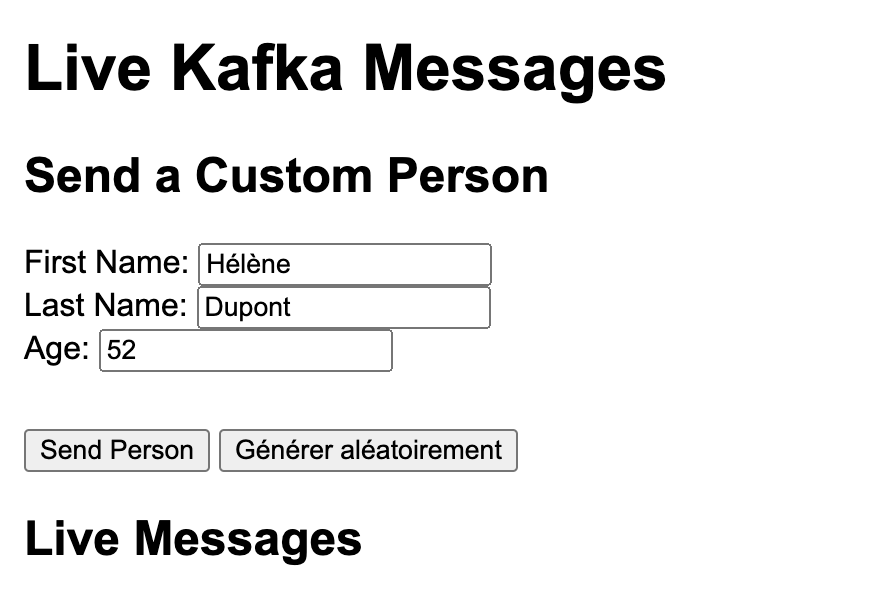
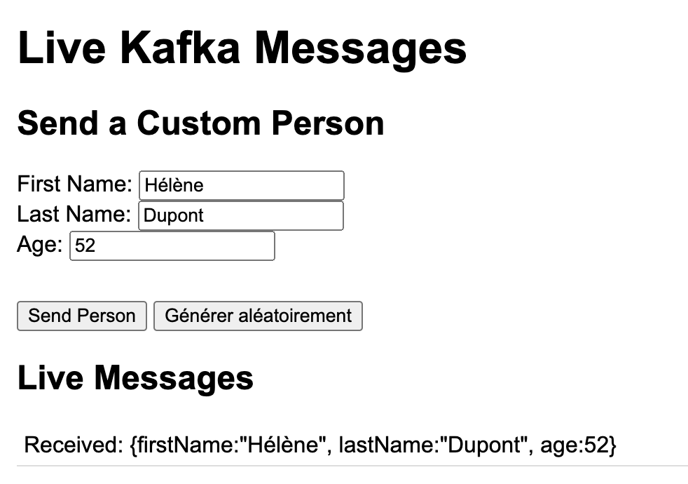
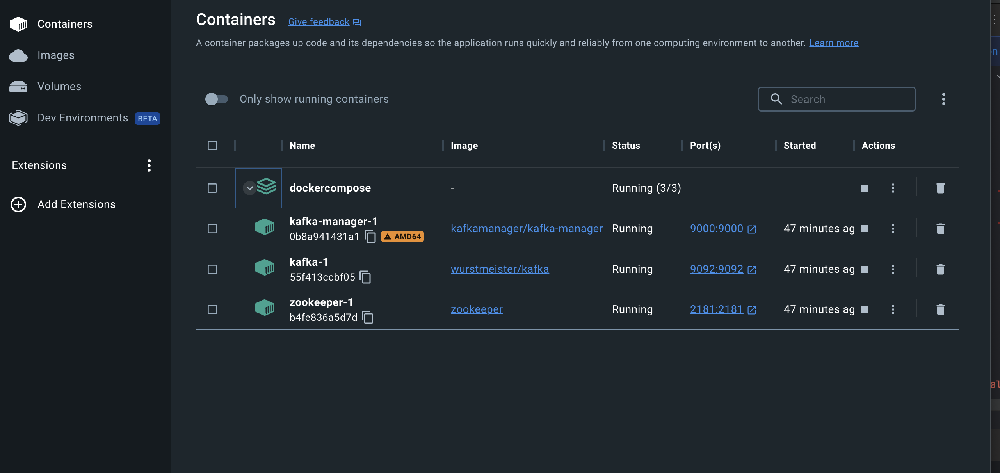

# Kafka Minimal Project Setup with Spring Boot and Thymeleaf UI

This project demonstrates a minimal configuration to set up and use **Apache Kafka** with **Spring Boot** and a simple **Thymeleaf**-based front-end. It is designed for developers who seek a basic understanding of Kafka, its purpose, how to integrate it into Spring Boot, and how to provide a real-time UI to display and send messages.




---

## What is Apache Kafka?

Apache Kafka is a distributed event-streaming platform designed for high-performance data pipelines, stream processing, and data integration. Kafka is widely used for building real-time data pipelines and streaming applications, ensuring durability and fault-tolerance.

### Key Kafka Components:
1. **Producers**: Applications or services that send messages to Kafka topics.
2. **Consumers**: Applications or services that read messages from Kafka topics.
3. **Topics**: Categories to which messages are sent.
4. **Zookeeper**: Manages Kafka's configuration, leader election, and health monitoring.

---

## Purpose of This Project

This project highlights:

- **Minimal Kafka configuration**: A basic setup using `docker-compose` for Kafka and Zookeeper.
- **Spring Boot integration**: Using Spring Kafka to send and receive serialized objects (`Person`).
- **Thymeleaf-based Server-Side Rendering (SSR)**: A simple UI rendered by Thymeleaf, allowing you to view messages in real-time without manual page reloads.
- **Server-Sent Events (SSE)**: Real-time updates from the back-end to the browser as new messages arrive.
- **Random Data Generation**: A button on the front-end that auto-fills the `Person` data (first name, last name, age) randomly, facilitating easy testing.

---

## Project Architecture

### Key Components:
1. **DTO (Data Transfer Object)**:
   - **`Person`**: Represents the data model exchanged through Kafka.

2. **Sender**:
   - **`KafkaSender`**: Implements the `ISender` interface to send `Person` objects to specific topics.

3. **Receiver**:
   - **`KafkaReceiver`**: Implements the `IReceiver` interface to listen to Kafka topics and process messages via `IProcess`.

4. **Configurations**:
   - **`KafkaSenderConfig`**: Configures the Kafka producer.
   - **`KafkaReceiverConfig`**: Configures the Kafka consumer.
   - **`KafkaTopicConfig`**: Manages Kafka topics.

5. **UI Layer (Thymeleaf + SSE)**:
   - **Thymeleaf Templates** (`index.html`): Rendered server-side, these pages include JavaScript to connect via SSE.
   - **SSE Endpoint (`/stream`)**: Keeps a server-sent event connection open, pushing new messages to the client in real-time.
   - **AJAX Submission**: The form is submitted with `fetch()` to avoid page reloads, maintaining a continuous SSE stream.
   - **Random Data Generation Button**: Quickly fill in the form with random `Person` data, making testing simpler.

6. **Docker Compose**:
   - Sets up Zookeeper, Kafka, and Kafka Manager for a local development environment.

---

### Visual Overview

```lua
    +-------------------+       +--------------------+
    |    Thymeleaf UI   | <---- | SSE (Spring Boot)  |
    | (Rendered by SB)  |       | KafkaSSEController |
    | - Live updates    |       |                    |
    | - Send Person AJAX|       |                    |
    +-------------------+       +--------------------+
              ^                         |
              |                         v
              |                   +-------------+
              |                   | Kafka Topics|
              |                   |  - Tuto1    |
              |                   |  - Tuto2    |
              |                   +-------------+
              |                         ^
              |                         |
              v                         |
    +-------------------+       +--------------------+
    | KafkaSender       |       |  KafkaReceiver     |
    |  - Sends Person   | --->  |  - Listens Topics  |
    |                   |       |  - Pushes SSE      |
    +-------------------+       +--------------------+
                                       |
                                       v
                              +--------------------+
                              |    Kafka Manager   |
                              |  & Zookeeper       |
                              |   + Kafka Broker   |
                              +--------------------+
```

---

## Project Structure (ASCII Tree)

```
.
├── DOCS
│   ├── docker-compose.yml
│   └── dockercompose.png
├── HELP.md
├── README.md
├── mvnw
├── mvnw.cmd
├── pom.xml
├── project-structure.txt
└── src
    ├── main
    │   ├── java
    │   │   └── com
    │   │       └── kitano
    │   │           └── kafka
    │   │               ├── KafkaApplication.java
    │   │               ├── dto
    │   │               │   └── Person.java
    │   │               ├── receiver
    │   │               │   ├── IProcess.java
    │   │               │   ├── IReceiver.java
    │   │               │   ├── KafkaReceiver.java
    │   │               │   ├── KafkaReceiverConfig.java
    │   │               │   └── ProcessExample.java
    │   │               ├── sender
    │   │               │   ├── ISender.java
    │   │               │   ├── KafkaSender.java
    │   │               │   ├── KafkaSenderConfig.java
    │   │               │   └── KafkaTopicConfig.java
    │   │               ├── service
    │   │               │   └── KafkaListenerService.java
    │   │               └── ui
    │   │                   ├── HealthCheckController.java
    │   │                   ├── KafkaSSEController.java
    │   │                   └── KafkaUIController.java
    │   └── resources
    │       ├── application.properties
    │       └── templates
    │           └── index.html
    └── test
        └── java
            └── com
                └── kitano
                    └── kafka
                        └── KafkaApplicationTests.java
```

---

## Setting Up Kafka on macOS

### Prerequisites:
1. **Docker Desktop**: Download and install [Docker Desktop](https://www.docker.com/products/docker-desktop/).
2. Verify installation:
   ```bash
   docker --version
   docker-compose --version
   ```

### Steps:
1. Clone the project repository:
   ```bash
   git clone <repository-url>
   cd <repository-directory>
   ```

2. Locate the `docker-compose.yml` file in the `DOCS` directory and run:
   ```bash
   docker-compose up
   ```



3. Open Kafka Manager:
   - Navigate to `http://localhost:9000`.
   - Add a new cluster:
      - **Cluster Name**: `kafka1`
      - **Zookeeper Host**: `zookeeper:2181`

---

## Running the Project

1. Start the Spring Boot application:
   ```bash
   ./mvnw spring-boot:run
   ```

2. Access the UI at `http://localhost:8080`:
   - A form to send a `Person` object.
   - A "Générer aléatoirement" button to fill the form fields with random data.
   - A live-updating message list, showing new Kafka messages in real-time via SSE.

3. Sending Data to Kafka:
   - Either manually fill in `firstName`, `lastName`, `age` or click the random button.
   - Click "Send Person" to submit the data asynchronously to the server, which sends it into Kafka.

4. Receiving Data:
   - The `KafkaListenerService` listens on `Tuto1` and `Tuto2` and updates the UI via SSE.
   - Messages appear instantly in the message list as they are received.

---

## Expected Results

1. **Kafka Manager**:
   - Check `http://localhost:9000`.
   - Verify that `Tuto1` and `Tuto2` topics exist and are receiving messages.

2. **UI Real-Time Updates**:
   - The `index.html` at `http://localhost:8080` updates as soon as messages arrive.
   - The random data generation button streamlines testing multiple `Person` objects.

3. **Console Output (Optional)**:
   - The application logs display sent and received messages.

---

## Example Console & UI Output

**Console:**
```
Message To Send : topicName=Tuto1, person={firstName:"Jean", lastName:"DUPOND", age:10}
Message Received: info=Tuto1Info, person={firstName:"Jean", lastName:"DUPOND", age:10}
```

**UI:**
- After clicking "Générer aléatoirement" and "Send Person", the UI lists the received message:
  ```
  Received: Person(firstName=Alice, lastName=Martin, age=29)
  ```

---

## Additional Notes

- **Customizing Kafka Address**: Update `application.properties` or environment variables for `kafka.bootstrapAddress`.
- **Docker Volumes**: Modify `docker-compose.yml` if persistent storage is needed.
- **Error Handling**: For production, consider adding more robust error handling and retries.

---

## Troubleshooting

1. **Cannot connect to Kafka**:
   - Ensure `docker-compose up` is running.
   - Verify `kafka.bootstrapAddress` in your configuration.

2. **Topics not visible in Kafka Manager**:
   - Confirm Zookeeper and Kafka are running.
   - Double-check Zookeeper host: `zookeeper:2181`.

3. **No messages visible in UI**:
   - Check Kafka Manager to ensure topics have data.
   - Ensure no network or firewall issues are blocking SSE.

---

## Conclusion

This project provides a starting point for integrating Apache Kafka with a Spring Boot application, showcasing how to send, receive, and display messages in real-time with a Thymeleaf-based front-end and SSE. The random data generation feature simplifies testing. For more details on Kafka setup, please refer to the original [article](https://dimbo.developpez.com/tutoriels/java/kafka/installation-kafka-et-execution-premier-programme-java/).
